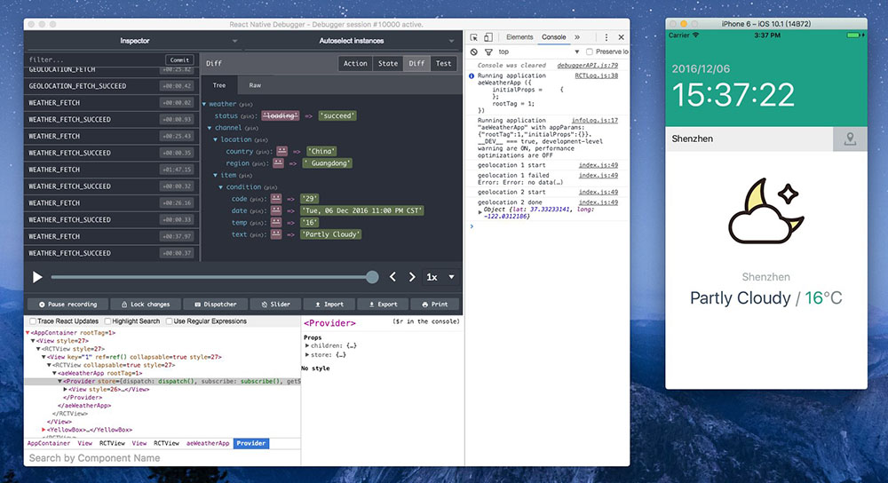

# ae-weather-app
[](https://github.com/aerycat/ae-weather-app/releases)
[](https://travis-ci.org/aerycat/ae-weather-app)

A simple react-native app demo



## Get start
**First**, follow the [official instructions](http://facebook.github.io/react-native/docs/getting-started.html) to configure the development environment.

**Then**
```
yarn || npm i
```
```
react-native run-ios
# or
react-native run-android
```
-------------

Stack List
- react-redux
- redux-saga
- redux-persist
- react-native-vector-icons
- etc.

> **Note:** The code files has some simple comments in Chinese.


