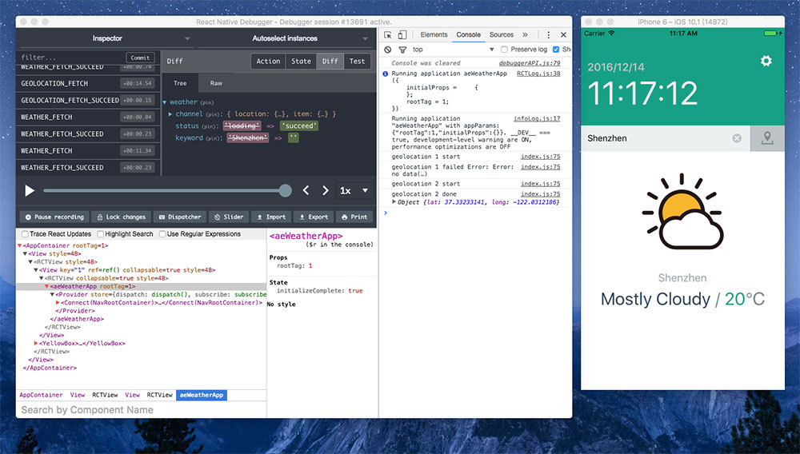

# ae-weather-app
[](https://github.com/aerycat/ae-weather-app/releases)
[](https://travis-ci.org/aerycat/ae-weather-app)

A simple react-native app demo



Please follow the [official instructions](https://facebook.github.io/react-native/) to configure the development environment.

### Then
```
npm i
# or
yarn
```
```
react-native run-ios
# or
react-native run-android
```


